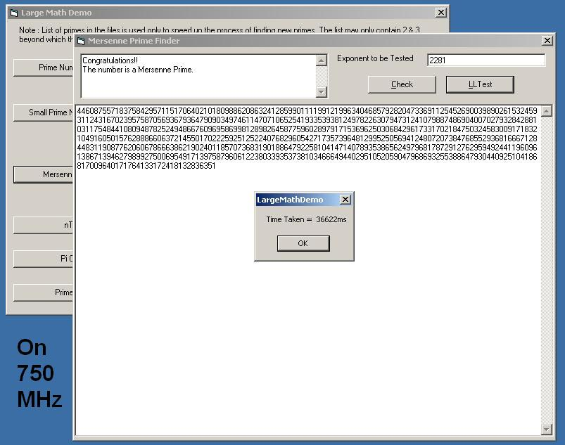



## Large Math \(Demo with Pi calculator and Mersenne Prime finder etc\)

### Description

The code demontrates a library of math functions designed to work on very very large numbers.

To name a few:

IsArrayPrime

IsArrayPrime2

IsArrayStrongProbablePrime

IsMersennePrimeExp

StringToArray

ArrayToString

ArrayToBin(ary)

ArrayToHexStr

ArrayCmp

AddArray

AddArray2

SubArray

SubArray2

ArrayMultiply

ArrayDivide

Sqrt (square root, yes)

PowerOf2

ArrayPower

PrimeFactorsOfArray

This is for all those Math Freaks, who would know its application. For those who don't, its applications include finding large Prime numbers for use in encryption and variety of other uses. Calculation of Pi (3.14159..) etc.

The demo demonstrates Prime number and Pi calculation primarily.

The code has been optimized to a very large extent, but if you find scope of improvement, please tell me. Also, foolproof testing of this code was very difficult for me, so if you find any bugs, please do tell me.

Thanks for your votes and comments.
 
### More Info
 

             |
---                |---
**Submitted On**   |2002-10-09 20:39:06
**By**             |[Nincompoop](https://github.com/Planet-Source-Code/PSCIndex/blob/master/ByAuthor/nincompoop.md)
**Level**          |Beginner
**User Rating**    |4.9 (49 globes from 10 users)
**Compatibility**  |VB 6\.0
**Category**       |[Math/ Dates](https://github.com/Planet-Source-Code/PSCIndex/blob/master/ByCategory/math-dates__1-37.md)
**World**          |[Visual Basic](https://github.com/Planet-Source-Code/PSCIndex/blob/master/ByWorld/visual-basic.md)
**Archive File**   |[Large\_Math14378810102002\.zip](https://github.com/Planet-Source-Code/nincompoop-large-math-demo-with-pi-calculator-and-mersenne-prime-finder-etc__1-39695/archive/master.zip)

